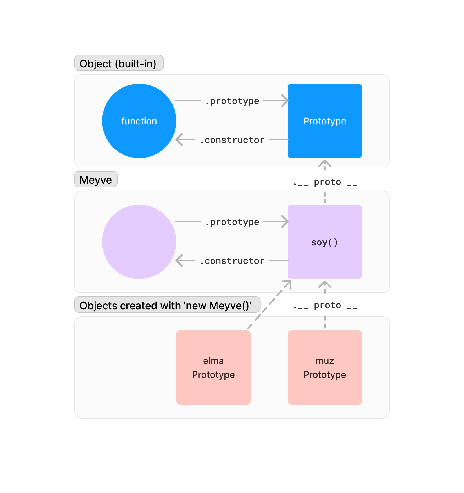

# 6. Prototypes

## 6.0. Prototype

- JavaScript'te her obje bir *prototype*'a sahiptir. *Prototype*, bir objenin diğer objelerden özelliklerini miras almasını sağlar.
- Bir objenin *prototype*'ına, `__proto__` *property*'si ile erişilebilir. Bir *prototype*'ın *property*'lerine ise `prototype` *property*'si ile erişilebilir.

    ```javascript
    const meyve = {
    isim: 'Elma'
    };

    console.log(meyve.__proto__ === Object.prototype); // true
    ```

- Objeler `new` anahtar kelimesi kullanılarak ***constructor call***'lar ile oluşturulur. ***Constructor call*** obje ve kendi *prototype*'ı ile bağlar.

## 6.1. Prototype Chain

- Bir objenin *prototype*'ı, bir başka objenin *prototype*'ı olabilir. Bu durumda bir ***prototype chain***  oluşur. Ve *prototype*'ın sahip olduğu özellikler, *prototype chain* ile birbirine bağlıdır.
- Tüm objelerin *prototype*'ları, `Object.prototype`'a kadar uzanır. Bu durumda bir objenin *prototype*'ı olmadığı zaman, `Object.prototype`'a bakılır.

    ```javascript
    function Meyve(isim) {
    this.isim = isim;
    }

    Meyve.prototype.soy = function() {
    console.log(this.isim, 'soyuldu!');
    };

    const elma = new Meyve('Elma');
    const muz = new Meyve('Muz');

    elma.soy(); // Elma soyuldu!
    muz.soy(); // Muz soyuldu!
    console.log(elma.__proto__ === Meyve.prototype); // true
    console.log(Meyve.prototype.__proto__ === Object.prototype); // true
    ```

    

- `Object.create(context)` fonksiyonu veya `new` anahtar kelimesi ile oluşturulan bir *object*'te erişilmeye çalışılan değer bulunamazsa `__proto__` property'sine bakılır. Fonksiyondaki `context` parametresi, *object*'in `__proto__` *property*'sine atanır.

    ```javascript
    const meyve = {
      isim: 'Elma'
    };

    const muz = Object.create(meyve);
    console.log(muz.isim); // Elma
    console.log(muz.__proto__ === meyve); // true
    ```

## 6.2. Shadowing

- *class* kullanılmadan gerçekleştirilen *inheritance* işlemlerinde, *prototype*'lar kullanılır. Bu durumda *prototype*'lar arasında ***shadowing*** olabilir. *Shadowing*, bir *prototype*'ın *property*'lerinin, bir başka *prototype*'ın *property*'lerini gizlemesi anlamına gelir.

### Infinite Recursion Problem

- Aşağıdaki örnekte `elma.yap` fonksiyonu, `elma` objesinin *prototype*'ındaki `yap` fonksiyonunu çağırır. Bu durumda `elma.yap` fonksiyonu, kendisini sürekli olarak çağırır ve sonsuz döngü oluşur.

    ```javascript
    function Meyve(isim) {
      this.isim = isim;
    }

    Meyve.prototype.yap = function(eylem) {
      console.log(this.isim, eylem);
    };

    const elma = new Meyve('Elma');

    elma.yap = function(eylem) {
        this.yap(eylem.toUpperCase());
    }

    elma.yap('yendi');
    ```

- Bu durumu engellemek için `elma.yap` fonksiyonu içerisinde `this.__proto__.yap` fonksiyonu çağrılmalıdır.

    ```javascript
    elma.yap = function(eylem) {
      this.__proto__.yap.call(this, eylem.toUpperCase());
    }
    ```

- *Class* kullanılmadan gerçekleştirilen [polymorphism](https://en.wikipedia.org/wiki/Polymorphism_(computer_science)), bu gibi makul olmayan çözümlere yol açabilir. Böyle durumlarda *class* kullanımı daha uygun olabilir.

## 6.3. Prototypal Inheritance

- JavaScript'te *class* kullanılmadan gerçekleştirilen *inheritance* işlemlerine ***prototypal inheritance*** denir. Bu durumda bir obje, diğer bir objenin *prototype*'ını miras alır.

    ```javascript
    function Meyve(isim) {
      this.isim = isim;
    }

    Meyve.prototype.yap = function(eylem) {
      console.log(this.isim, eylem);
    };

    function Elma(isim, renk) {
      Meyve.call(this, isim);
      this.renk = renk;
    }

    Elma.prototype = Object.create(Meyve.prototype);
    Elma.prototype.soy = function() {
      this.yap.call(this, 'soyuldu!');
    };

    const elma = new Elma('Elma', 'kırmızı');
    elma.soy(); // Elma soyuldu!
    ```

### Class Inheritance ve Prototypal Inheritance Farkı

Diğer dillerde gerçekleşen inheritance işlemlerinde inherit edilen *class*'ın *property*'leri, *subclass*'a kopyalanır. Fakat JavaScript'te gerçekleşen *inheritance* işlemlerinde kopyalama gerçekleştirmek yerine aralarında bağ kurar. *Subclass*, *prototype chain* kullanarak *superclass*'ın *property*'lerine erişebilir.

> **Subclass**: Inherit eden *class*
> 
> **Superclass**: Inherit edilen *class*

## 6.4. Delegation Pattern

- JavaScript'te *class* kullanılmadan gerçekleştirilen *inheritance* işlemlerine ***delegation pattern*** denir. Bu durumda bir obje, diğer bir objenin *property*'lerini kullanır.

    ```javascript
    const Meyve = {
      init: function(isim) {
        this.isim = isim;
      },
      yap: function(eylem) {
        console.log(this.isim, eylem);
      }
    };

    const Elma = Object.create(Meyve);
    Elma.init = function(isim, renk) {
      Meyve.init.call(this, isim);
      this.renk = renk;
    };
    Elma.soy = function() {
      this.yap('soyuldu!');
    };

    const elma = Object.create(Elma);
    elma.init('Elma', 'kırmızı');
    elma.soy(); // Elma soyuldu!
    ```
