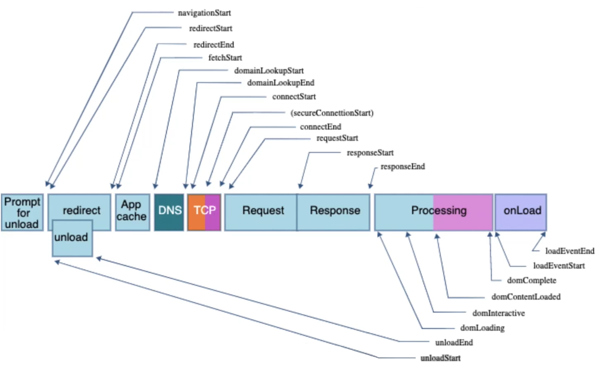

# Web Performansının Temelleri

## 1. Performansın Temelleri

### Performans Neden Önemli?

- Çünkü **Google** öyle diyor.
- Ne kadar **hızlı** olursa o kadar iyi **kullanıcı deneyimi** sunar. Ne kadar iyi  **kullanıcı deneyimi** sunarsa o kadar çok **kullanıcıya** ulaşır. Ne kadar çok **kullanıcıya** ulaşırsa o kadar çok **para** kazanır.

### Beklemenin Psikolojisi

- Beklemek göreceli bir kavramdır ve bir çok faktöre bağlıdır.
- Beklemeyi göze aldığımız zaman, beklentilerimiz ve beklerken ne yapabildiğimize göre değişir.

#### İnsanlar bir an önce başlamak ister

Eğer erken bir başlangıç verirseniz bekleme süresinin kısa olduğunu düşünürler. Ama başlamak istedikleri halde onlara bir şey vermezseniz bekleme süresi yavaş hissettirir.

#### Sıkıcı şeyler daha yavaş hissettirir

Eğer kullanıcının yapacak veya bakacak herhangi bir şeyi yoksa bekleme süresi normalden daha uzun hissedilir.

#### Gerginlik daha yavaş hissettirir

Eğer bir test sonucunu bekliyorsanız, başvurduğunuz kredinin onaylanıp onaylanmadığını bekliyorsanız, bekleme süresi daha uzun hissettirir.

#### Anlamsız bekleme daha yavaş hissettirir

Eğer neden beklediğinizi bilmiyorsanız veya kimse neden beklediğinizle ilgili bir cevap veremiyorsa bekleme süresi daha uzun hissettirir.

#### Ne kadar bekleyeceğini bilmeme daha yavaş hissettirir

Eğer ne kadar bekleyeceğinizi bilmiyorsanız, yaptığınız işlemin ne kadar süreceği hakkında bir tahmininiz de yoksa bekleme süresi daha uzun hissettirir.

#### İnsanlar değerli olan şeyler için beklemeye daha isteklidir

Eğer beklediğiniz şeyin değerli olduğunu düşünüyorsanız, beklemeye daha istekli olursunuz. Yeni ürün çıktığında Apple mağazalarında kuyruğa girilmesinin sebebi de budur. Kimse değer vermediği bir şey için beklemek istemez.

### Web Vitals

#### Eski Metrikler

Eskiden performansı ölçmek için **Page Load Time** *-HTML dokümanının yüklenme süresi-* baz alınırdı. Ancak bu metrik, günümüzdeki web uygulamaları için yeterli değildir.

Günümüzde *React*, *Vue* gibi **Single Page Application** geliştirilebilmesini sağlayan kütüphaneler, kullanıcıya öncelikle boş bir HTML sayfası gönderir. Ardından javascript ile sayfa içeriği yüklenir. Bu yüzden **Page Load Time** metriği bu tür uygulamalarda kullanıcı deneyimini tam olarak yansıtamaz

Bu yüzden günümüzde bu metrik terk edilerek yerine **Google**'ın geliştirdiği **Web Vitals** metrikleri kullanılmaya başlandı.

#### Web Vitals Metrikleri


- **FCP (First Contentful Paint)**: Sayfa üzerindeki ***ilk içeriğin yüklenme süresini*** ölçer. Eğer sayfa üzerindeki ilk içerik geç yüklenirse bu metrik yüksek olur. Burada sayfada gerçekleşen ilk render işlemi kastedilir. Kullanıcının sayfanın yüklenmeye başladığını gördüğü anlamına gelir.
- **LCP (Largest Contentful Paint)**: Sayfa üzerindeki ***en büyük içeriğin yüklenme süresini*** ölçer. Eğer sayfa üzerindeki en büyük içerik geç yüklenirse bu metrik yüksek olur. Genellikle bu metrik, sayfa üzerindeki en büyük görsel veya yazı içeriğidir. Kullanıcının sayfa üzerindeki en büyük içeriği gördüğü anlamına gelir.
- **FID (First Input Delay)**: Kullanıcı ilk ***etkileşimde bulunabilene kadar geçen süreyi*** ölçer. Eğer sayfa üzerindeki içeriklerle etkileşime geçmek için uzun süre beklemek zorunda kalıyorsa bu metrik yüksek olur.
- **CLS (Cumulative Layout Shift)**: Sayfa üzerindeki ***içeriklerin sayfa var olduğu müddetçe ne kadar stabil olduğunu*** ölçer. Eğer sayfa üzerindeki içerikler sürekli olarak kayıyorsa bu metrik yüksek olur.

### Lighthouse


- **Lighthouse**, **Google** tarafından geliştirilmiş olan web uygulamalarının performansını ölçmek için kullanılan bir araçtır. Tarayıcının geliştirici konsolunda çalışır. Sunduğu raporlar sayesinde web uygulamalarının performansı ölçülebilir ve performansın arttırılması için neler yapılması gerektiğini öğrenilebilir.
- Dikkat edilmesi gereken ilk şey Lighthouse çalıştırılırken geliştirici konsolunun ekran boyutunu küçültecek şekilde tarayıcıya bağlı olmamasıdır. Küçük bir sayfada çalıştırılan Lighthouse, o boyuttaki bir sayfanın performansını ölçer.
- Alınan raporlardaki metrikler, kullanılan bilgisayar ve sahip olunan internetin performansına göre değişiklik gösterebilir. Bu yüzden raporları alırken farklı cihazlarda ve farklı internet hızlarında test etmek faydalı olacaktır.

## 2. Metrikler

### Performans Nerede Ölçülür?

#### Laboratuvar Ortamında

Yukarıda bahsedilen **Web Vitals** testleri aslında laboratuvar ortamında yapılan bir testtir. Bu testler, kullanıcıların gerçek dünyada yaşadığı deneyimi tam olarak yansıtmaz.

- **Lighthouse**'un sunduğu raporlar da laboratuvar ortamında yapılan testlerin sonuçlarıdır.

  

#### Test Sunucuları Üzerinde

Gerçek kullanıcıya ihtiyaç duyulmadan yapılabilecek diğer bir test ise yapay veri (*synthetic data*) kullanılarak yapılan testlerdir.

Bu testlerde kullanıcıların gerçek dünyada yaşadığı deneyimi tam olarak yansıtmaz fakat laboratuvar ortamında yapılan testlerden daha gerçekçi sonuçlar verir. Bu testler ***APM (Application Performance Monitoring) Tool***'ları ile yapılabilir.

Örnek olarak **New Relic**, **Pingdom**, **Datadog** ve **Dynatrace** bu servisi sunmakta.

#### Gerçek Kullanıcıların Cihazlarında

Gerçek kullanıcılarla yapılan testler ise **Real User Monitoring (RUM)** araçları ile yapılır. Bu testlerde kullanıcıların gerçek dünyada yaşadığı deneyimler ölçülür. Bu testlerin sonuçları laboratuvar ortamında yapılan testlerden ve yapay verilerle yapılan testlerden daha gerçekçi sonuçlar verir.

Bu testlerde kullanıcılardan alınan verilerin konum, cihaz, tarayıcı, internet hızı gibi bilgiler dikkate alınarak sınıflandırılması gerekmektedir. Bu sınıflandırmalar hedef kitlesinin belirlenmesinde ve kitleye uygun çözümler sunulmasında yardımcı olur.

> **Google**'ın sağladığı [**web.dev**](https://web.dev/) adresinden, web performansı ve **Core Web Vitals** ile ilgili bir çok bilgiye ulaşabilirsiniz.

### Verileri Yorumlamak

Performans veri seti yorumlanırken önemli olan kriter ortalama değil, dağılımlardır. Skor ortalamasının iyi olması, kullanıcıların genelinin iyi bir deneyim yaşadığı anlamına gelmez. Önemli olan skor dağılımının iyi olmasıdır.

> Örneğin kullanıcılarınızın çeyreği çok iyi bir performans gözlemlerken kalanı yeterli bir performans gözlemleyemiyorsa, ortalama değeriniz yüksek olduğu halde kullanıcılarınızın çoğunluğu iyi bir deneyim yaşamadığı anlamına gelir.  

Burada medyan devreye girer. **Medyan (p50)**, veri setindeki **orta değeri** ifade eder. Yani veri setinizdeki değerlerin yarısı medyan değerinden küçük, yarısı medyan değerinden büyüktür.

Google'ın dikkat ettiği bölge ise %75'lik dilimdir. Bu dilim iyi bir performans gösteriyorsa, kullanıcıların çoğunluğunun iyi bir deneyim yaşadığı söylenebilir.

> %95'lik dilimin dışında kalan veriler en kötü deneyimi yaşayan %5'lik dilimi temsil eder. Bu dilimdeki kullanıcılarınızın deneyimini iyileştirmek çok zordur. Bu dilimi hedef almak optimal bir strateji olmayabilir.

## 3. Performansı İyileştirmek

### Web İşletmesinin Hedefi

1. **Farkındalık**: Neler yaptığınız ve ürünlerinizin ne olduğu hakkında bilgi vermek.
2. **Muhafaza**: Kullanıcılarınızı yakında tutarak ürünlerinizin kullanımını artırmak.
3. **Dönüşüm**: Yeni kullanıcılar kazanmak ve mevcut etkileşimleri gelire dönüştürmek.
4. **Rekabet**: Rakiplerinizden iyi olmak.

> Ancak %20 oranında performans farkı kullanıcılar tarafından fark edilebilir. Yeterli performans sağlandıktan sonra daha fazla performans iyileştirmeleri yapmak yerine, başka alanlarda iyileştirmeler yapmak daha mantıklı bir karar olacaktır.

### Performance API

**Performance API**, tarayıcıların performans verilerine erişmek için kullanılan bir API'dir. Bu API sayesinde tarayıcıların performans verilerine erişebilir ve bu verileri kullanarak performans ölçülebilir.

> MDN'de [**Performance API**](https://developer.mozilla.org/en-US/docs/Web/API/Performance) hakkında daha fazla bilgi bulabilirsiniz.

```javascript
const performance = window.performance;

const navigationTiming = performance.getEntries();
console.log(navigationTiming);
```



> Görsel [MDN](https://developer.mozilla.org/en-US/docs/Learn/Performance/Measuring_performance) adresinden alınmıştır.

```json
[
  ...
  {
    "connectEnd": 163.22,
    "connectStart": 75.35,
    "domComplete": 650.51,
    "domContentLoadedEventEnd": 531.47,
    "domContentLoadedEventStart": 529.13,
    "domInteractive": 497.93,
    "domainLookupEnd": 75.35,
    "domainLookupStart": 20.75,
    "duration": 650.51,
    "entryType": "navigation",
    "fetchStart": 4.37,
    "loadEventEnd": 650.51,
    "loadEventStart": 650.50,
    "name": "http://localhost:3000/",
    "redirectEnd": 0,
    "redirectStart": 0,
    "requestStart": 163.22,
    "responseEnd": 213.92,
    "responseStart": 211.62,
    "secureConnectionStart": 120.98,
    "type": "navigate"
  },
  ...
]
```

> **Performance API**'nin sunduğu veriler, tarayıcıların performans verileri olduğu için tarayıcıya bağlı olarak değişiklik gösterebilir.

## 4. Metriklerin İyileştirilmesi

### FCP (First Contentful Paint)

Bir web sayfası açıldığında sunucudan kullanıcıya gitmesi gereken bir takım dokümanlar var. FCP'nin ölçümü, bu dokümanların kullanıcıya ulaşma süresini ölçer.

- Sunucunun hızlı olması
- Sunucunun kullanıcıya yakın olması
- Gönderilen dokümanların boyutunun küçük olması

#### Sunucunun Hızlı Olması

- Sunucunun fiziksel özellikleri *istisnai durumlar dikkate alınarak* web uygulamasının ihtiyacına göre yapılandırılması.

  > Pizza taşımak için tır, masa taşımak için bisiklet kullanmayın. İhtiyaçlarınıza uygun bir sunucu tercih edin.

- Sunucuda kullanıcıya gönderilecek cevabı geciktirecek işlemler yapmaktan kaçınılması.

  > Yapmanız için bir gereklilik yoksa basit bir `index.html` dosyası için veri tabanına istek atmak zorunda değilsiniz.

#### Küçük Dokümanlar

- Javascript ve CSS dosyalarının boyutları **CSS minify** ve **JS Minify** araçları kullanılarak küçültülmesi.

  > **Rollup**, **Webpack**, **Turbopack** ve **TailwindCSS** gibi araçlar, bu işlemi otomatik olarak yapar.

- Dokümanların **gzip** gibi sıkıştırma araçları kullanarak sıkıştırılması.

  > **Nginx** ve **Apache** gibi sunucuların ayarlarını configure ederek bu işlemi otomatik olarak yapılabilir.

- Resimleri **WebP** gibi sıkıştırılmış formatlara dönüştürülerek boyutlarının düşürülmesi.

#### Sunucunun Kullanıcıya Yakın Olması

- Uygulamaya Dünya'nın farklı yerlerinden erişmeye çalışan kullanıcılar için **CDN (Content Delivery Network)** hizmetleri kullanılarak kullanıcının kendisine yakın sunucudan veri almasının sağlanması.

> **CDN**'ler, sunucunuzda bulunan dokümanları dünya üzerinde farklı noktalardaki sunuculara kopyalayarak, kullanıcının dokümanlara daha hızlı ulaşmasını sağlar.
> Örnek olarak **Cloudflare**, **Fastly** ve **Akamai** gibi servisler kullanılabilir.

### LCP (Largest Contentful Paint)

Bir web sayfası açıldığında, sayfa üzerindeki yüklenme süresi en uzun olan içeriğin yüklenme süresini ölçer.

- Kaynakları yüklemeyi ertelemek
- Resimlerinizi optimize etmek
- HTTP isteklerinizi küçültmek

#### Kaynakları Yüklemeyi Ertelemek

Sayfa üzerinde bulunan tüm içerikler hemen yüklemek zorunda değildir. Kullanıcı etkileşime geçmeden önce gözükmeyen, görünmesi için sayfanın kaydırılması gereken içerikler olabilir. Bu içeriklerin yüklenmesini erteleyerek ***-lazy loading-***, sayfa üzerindeki en büyük içeriğin yüklenme süresini kısaltabilirsiniz.

- Önceliği olmayan Javascript dosyalarının **async** veya **defer** etiketleri kullanılarak ertelenmesi başlangıçta yüklenmesi gereken dosya sayısını azaltarak önemli dosyaların daha hızlı yüklenmesini sağlar.

  ```html
  <p>Script tag'inden önce</p>

  <script src="script.js"></script>

  <!-- Bu satır script dosyası yüklenene kadar gözükmez -->
  <p>Script tag'inden sonra</p>
  ```

  

> - Yeşil HTML parse edilmesi
> - Mavi javascript dosyasının indirilmesi
> - Kırmızı javascript dosyasının çalıştırılması
> - Gri HTML parse işleminin duraklatılmasıdır

- **async** etiketi ile yüklenen dosyalar hızlı şekilde indirilir ve indirme işlemi tamamlandığında çalıştırılır. Fakat bu dosyaların yüklenme sırası garanti edilemez.

  ```html
  <p> Script tag'inden önce </p>

  <script async src="script.js"></script>

  <!-- Bu satır script dosyasını beklemeden görünür hale gelecektir-->
  <p> Script tag'inden sonra </p>
  ```

  

- **defer** etiketi ile yüklenen dosyalar hızlı şekilde indirilir ve tüm sayfanın yüklenme işlemi tamamlandıktan sonra çalıştırılır.

  ```html
  <p> Script tag'inden önce </p>

  <script defer src="script.js"></script>

  <!-- Bu satır script dosyasını beklemeden görünür hale gelecektir-->
  <p> Script tag'inden sonra </p>
  ```

  

> Görseller [Growing With The Web](https://www.growingwiththeweb.com/2014/02/async-vs-defer-attributes.html) adresinden alınmıştır.

- Tüm bunlara ek olarak script etiketlerinin sayfanın sonunda kullanılması, script dosyasının daha geç yüklenmeye başlamasına ve sayfa yükleme işleminin başlangıcındaki yükün azlatılmasına yardımcı olur.

#### Resimlerinizi Optimize Etmek

- `` etiketlerinde `loading="lazy"` özelliğini kullanarak resimlerin yüklenmeye başlama süresini erteleyebilirsiniz. Bu sayede ilk açılışta görülmeyen resimlerin yüklenme süresi daha sonra başlanmak üzere ertelenir.

  ```html
  
  ```
