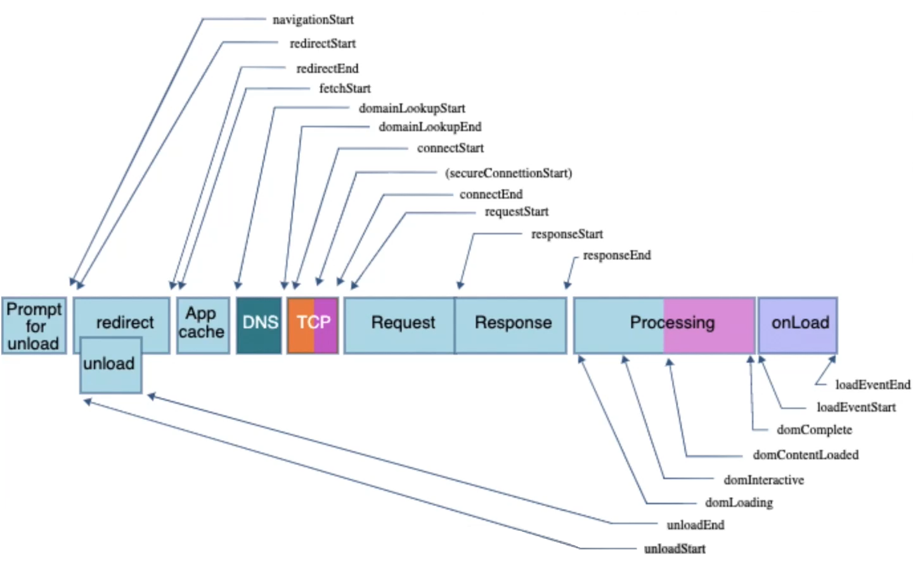
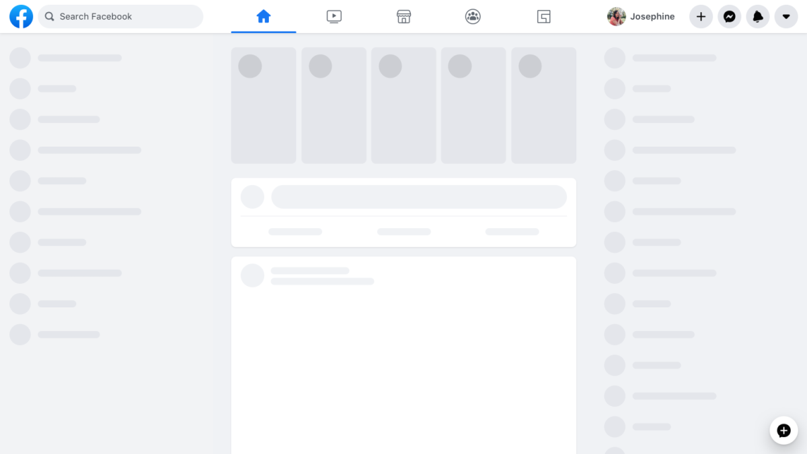
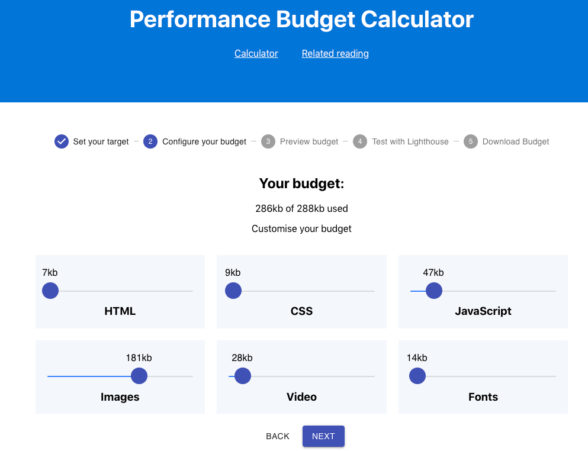

# Web Performansının Temelleri

## 1. Performansın Temelleri

### Performans Neden Önemli?

- Çünkü **Google** öyle diyor.
- Ne kadar **hızlı** olursa o kadar iyi **kullanıcı deneyimi** sunar. Ne kadar iyi  **kullanıcı deneyimi** sunarsa o kadar çok **kullanıcıya** ulaşır. Ne kadar çok **kullanıcıya** ulaşırsa o kadar çok **para** kazanır.

### Beklemenin Psikolojisi

- Beklemek göreceli bir kavramdır ve bir çok faktöre bağlıdır.
- Beklemeyi göze aldığımız zaman, beklentilerimiz ve beklerken ne yapabildiğimize göre değişir.

#### İnsanlar bir an önce başlamak ister

Eğer erken bir başlangıç verirseniz bekleme süresinin kısa olduğunu düşünürler. Ama başlamak istedikleri halde onlara bir şey vermezseniz bekleme süresi yavaş hissettirir.

#### Sıkıcı şeyler daha yavaş hissettirir

Eğer kullanıcının yapacak veya bakacak herhangi bir şeyi yoksa bekleme süresi normalden daha uzun hissedilir.

#### Gerginlik daha yavaş hissettirir

Eğer bir test sonucunu bekliyorsanız, başvurduğunuz kredinin onaylanıp onaylanmadığını bekliyorsanız, bekleme süresi daha uzun hissettirir.

#### Anlamsız bekleme daha yavaş hissettirir

Eğer neden beklediğinizi bilmiyorsanız veya kimse neden beklediğinizle ilgili bir cevap veremiyorsa bekleme süresi daha uzun hissettirir.

#### Ne kadar bekleyeceğini bilmeme daha yavaş hissettirir

Eğer ne kadar bekleyeceğinizi bilmiyorsanız, yaptığınız işlemin ne kadar süreceği hakkında bir tahmininiz de yoksa bekleme süresi daha uzun hissettirir.

#### İnsanlar değerli olan şeyler için beklemeye daha isteklidir

Eğer beklediğiniz şeyin değerli olduğunu düşünüyorsanız, beklemeye daha istekli olursunuz. Yeni ürün çıktığında Apple mağazalarında kuyruğa girilmesinin sebebi de budur. Kimse değer vermediği bir şey için beklemek istemez.

### Web Vitals

#### Eski Metrikler

Eskiden performansı ölçmek için **Page Load Time** *-HTML dokümanının yüklenme süresi-* baz alınırdı. Ancak bu metrik, günümüzdeki web uygulamaları için yeterli değildir.

Günümüzde *React*, *Vue* gibi **Single Page Application** geliştirilebilmesini sağlayan kütüphaneler, kullanıcıya öncelikle boş bir HTML sayfası gönderir. Ardından javascript ile sayfa içeriği yüklenir. Bu yüzden **Page Load Time** metriği bu tür uygulamalarda kullanıcı deneyimini tam olarak yansıtamaz

Bu yüzden günümüzde bu metrik terk edilerek yerine **Google**'ın geliştirdiği **Web Vitals** metrikleri kullanılmaya başlandı.

#### Web Vitals Metrikleri


- **FCP (First Contentful Paint)**: Sayfa üzerindeki ***ilk içeriğin yüklenme süresini*** ölçer. Eğer sayfa üzerindeki ilk içerik geç yüklenirse bu metrik yüksek olur. Burada sayfada gerçekleşen ilk render işlemi kastedilir. Kullanıcının sayfanın yüklenmeye başladığını gördüğü anlamına gelir.
- **LCP (Largest Contentful Paint)**: Sayfa üzerindeki ***en büyük içeriğin yüklenme süresini*** ölçer. Eğer sayfa üzerindeki en büyük içerik geç yüklenirse bu metrik yüksek olur. Genellikle bu metrik, sayfa üzerindeki en büyük görsel veya yazı içeriğidir. Kullanıcının sayfa üzerindeki en büyük içeriği gördüğü anlamına gelir.
- **FID (First Input Delay)**: Kullanıcı ilk ***etkileşimde bulunabilene kadar geçen süreyi*** ölçer. Eğer sayfa üzerindeki içeriklerle etkileşime geçmek için uzun süre beklemek zorunda kalıyorsa bu metrik yüksek olur.
- **CLS (Cumulative Layout Shift)**: Sayfa üzerindeki ***içeriklerin sayfa var olduğu müddetçe ne kadar stabil olduğunu*** ölçer. Eğer sayfa üzerindeki içerikler sürekli olarak kayıyorsa bu metrik yüksek olur.

### Lighthouse


- **Lighthouse**, **Google** tarafından geliştirilmiş olan web uygulamalarının performansını ölçmek için kullanılan bir araçtır. Tarayıcının geliştirici konsolunda çalışır. Sunduğu raporlar sayesinde web uygulamalarının performansı ölçülebilir ve performansın arttırılması için neler yapılması gerektiğini öğrenilebilir.
- Dikkat edilmesi gereken ilk şey Lighthouse çalıştırılırken geliştirici konsolunun ekran boyutunu küçültecek şekilde tarayıcıya bağlı olmamasıdır. Küçük bir sayfada çalıştırılan Lighthouse, o boyuttaki bir sayfanın performansını ölçer.
- Alınan raporlardaki metrikler, kullanılan bilgisayar ve sahip olunan internetin performansına göre değişiklik gösterebilir. Bu yüzden raporları alırken farklı cihazlarda ve farklı internet hızlarında test etmek faydalı olacaktır.

## 2. Metrikler

### Performans Nerede Ölçülür?

#### Laboratuvar Ortamında

Yukarıda bahsedilen **Web Vitals** testleri aslında laboratuvar ortamında yapılan bir testtir. Bu testler, kullanıcıların gerçek dünyada yaşadığı deneyimi tam olarak yansıtmaz.

- **Lighthouse**'un sunduğu raporlar da laboratuvar ortamında yapılan testlerin sonuçlarıdır.

  

#### Test Sunucuları Üzerinde

Gerçek kullanıcıya ihtiyaç duyulmadan yapılabilecek diğer bir test ise yapay veri (*synthetic data*) kullanılarak yapılan testlerdir.

Bu testlerde kullanıcıların gerçek dünyada yaşadığı deneyimi tam olarak yansıtmaz fakat laboratuvar ortamında yapılan testlerden daha gerçekçi sonuçlar verir. Bu testler ***APM (Application Performance Monitoring) Tool***'ları ile yapılabilir.

Örnek olarak **New Relic**, **Pingdom**, **Datadog** ve **Dynatrace** bu servisi sunmakta.

#### Gerçek Kullanıcıların Cihazlarında

Gerçek kullanıcılarla yapılan testler ise **Real User Monitoring (RUM)** araçları ile yapılır. Bu testlerde kullanıcıların gerçek dünyada yaşadığı deneyimler ölçülür. Bu testlerin sonuçları laboratuvar ortamında yapılan testlerden ve yapay verilerle yapılan testlerden daha gerçekçi sonuçlar verir.

Bu testlerde kullanıcılardan alınan verilerin konum, cihaz, tarayıcı, internet hızı gibi bilgiler dikkate alınarak sınıflandırılması gerekmektedir. Bu sınıflandırmalar hedef kitlesinin belirlenmesinde ve kitleye uygun çözümler sunulmasında yardımcı olur.

> **Google**'ın sağladığı [**web.dev**](https://web.dev/) adresinden, web performansı ve **Core Web Vitals** ile ilgili bir çok bilgiye ulaşabilirsiniz.

### Verileri Yorumlamak

Performans veri seti yorumlanırken önemli olan kriter ortalama değil, dağılımlardır. Skor ortalamasının iyi olması, kullanıcıların genelinin iyi bir deneyim yaşadığı anlamına gelmez. Önemli olan skor dağılımının iyi olmasıdır.

> Örneğin kullanıcılarınızın çeyreği çok iyi bir performans gözlemlerken kalanı yeterli bir performans gözlemleyemiyorsa, ortalama değeriniz yüksek olduğu halde kullanıcılarınızın çoğunluğu iyi bir deneyim yaşamadığı anlamına gelir.  

Burada medyan devreye girer. **Medyan (p50)**, veri setindeki **orta değeri** ifade eder. Yani veri setinizdeki değerlerin yarısı medyan değerinden küçük, yarısı medyan değerinden büyüktür.

Google'ın dikkat ettiği bölge ise %75'lik dilimdir. Bu dilim iyi bir performans gösteriyorsa, kullanıcıların çoğunluğunun iyi bir deneyim yaşadığı söylenebilir.

> %95'lik dilimin dışında kalan veriler en kötü deneyimi yaşayan %5'lik dilimi temsil eder. Bu dilimdeki kullanıcılarınızın deneyimini iyileştirmek çok zordur. Bu dilimi hedef almak optimal bir strateji olmayabilir.

## 3. Performansı İyileştirmek

### Web işletmesinin Hedefi

1. **Farkındalık**: Neler yaptığınız ve ürünlerinizin ne olduğu hakkında bilgi vermek.
2. **Muhafaza**: Kullanıcılarınızı yakında tutarak ürünlerinizin kullanımını artırmak.
3. **Dönüşüm**: Yeni kullanıcılar kazanmak ve mevcut etkileşimleri gelire dönüştürmek.
4. **Rekabet**: Rakiplerinizden iyi olmak.

> Ancak %20 oranında performans farkı kullanıcılar tarafından fark edilebilir. Yeterli performans sağlandıktan sonra daha fazla performans iyileştirmeleri yapmak yerine, başka alanlarda iyileştirmeler yapmak daha mantıklı bir karar olacaktır.

### Performance API

**Performance API**, tarayıcıların performans verilerine erişmek için kullanılan bir API'dir. Bu API sayesinde tarayıcıların performans verilerine erişebilir ve bu verileri kullanarak performans ölçülebilir.

> MDN'de [**Performance API**](https://developer.mozilla.org/en-US/docs/Web/API/Performance) hakkında daha fazla bilgi bulabilirsiniz.

```javascript
const performance = window.performance;

const navigationTiming = performance.getEntries();
console.log(navigationTiming);
```



> Görsel [MDN](https://developer.mozilla.org/en-US/docs/Learn/Performance/Measuring_performance) adresinden alınmıştır.

```json
[
  ...
  {
    "connectEnd": 163.22,
    "connectStart": 75.35,
    "domComplete": 650.51,
    "domContentLoadedEventEnd": 531.47,
    "domContentLoadedEventStart": 529.13,
    "domInteractive": 497.93,
    "domainLookupEnd": 75.35,
    "domainLookupStart": 20.75,
    "duration": 650.51,
    "entryType": "navigation",
    "fetchStart": 4.37,
    "loadEventEnd": 650.51,
    "loadEventStart": 650.50,
    "name": "http://localhost:3000/",
    "redirectEnd": 0,
    "redirectStart": 0,
    "requestStart": 163.22,
    "responseEnd": 213.92,
    "responseStart": 211.62,
    "secureConnectionStart": 120.98,
    "type": "navigate"
  },
  ...
]
```

Yukarıdaki veriler, tarayıcı üzerindeki bir sayfanın yüklenme süresi ile ilgili verilerdir. Bu verileri kullanarak sayfa üzerindeki performansı ölçebilir ve performansı iyileştirmek için neler yapılması gerektiğini öğrenebilirsiniz.

> **Performance API**'nin sunduğu veriler, tarayıcıların performans verileri olduğu için tarayıcıya bağlı olarak değişiklik gösterebilir.

## 4. Metriklerin iyileştirilmesi

### FCP (First Contentful Paint)

Bir web sayfası açıldığında sunucudan kullanıcıya gitmesi gereken bir takım dokümanlar var. FCP'nin ölçümü, bu dokümanların kullanıcıya ulaşma süresini ölçer.

- Sunucunun hızlı olması
- Sunucunun kullanıcıya yakın olması
- Gönderilen dokümanların boyutunun küçük olması

#### Sunucunun Hızlı Olması

- Sunucunun fiziksel özellikleri *istisnai durumlar dikkate alınarak* web uygulamasının ihtiyacına göre yapılandırılması.

  > Pizza taşımak için tır, masa taşımak için bisiklet kullanmayın. İhtiyaçlarınıza uygun bir sunucu tercih edin.

- Sunucuda kullanıcıya gönderilecek cevabı geciktirecek işlemler yapmaktan kaçınılması.

  > Yapmanız için bir gereklilik yoksa basit bir `index.html` dosyası için veri tabanına istek atmak zorunda değilsiniz.

#### Küçük Dokümanlar

- Javascript ve CSS dosyalarının boyutları **CSS minify** ve **JS Minify** araçları kullanılarak küçültülmesi.

  > **Rollup**, **Webpack**, **Turbopack** ve **TailwindCSS** gibi araçlar, bu işlemi otomatik olarak yapar.

- Dokümanların **gzip** gibi sıkıştırma araçları kullanarak sıkıştırılması.

  > **Nginx** ve **Apache** gibi sunucuların ayarlarını configure ederek bu işlemi otomatik olarak yapılabilir.

- Resimleri **WebP** gibi sıkıştırılmış formatlara dönüştürülerek boyutlarının düşürülmesi.

#### Sunucunun Kullanıcıya Yakın Olması

- Uygulamaya Dünya'nın farklı yerlerinden erişmeye çalışan kullanıcılar için **CDN (Content Delivery Network)** hizmetleri kullanılarak kullanıcının kendisine yakın sunucudan veri almasının sağlanması.

> **CDN**'ler, sunucunuzda bulunan dokümanları dünya üzerinde farklı noktalardaki sunuculara kopyalayarak, kullanıcının dokümanlara daha hızlı ulaşmasını sağlar.
> Örnek olarak **Cloudflare**, **Fastly** ve **Akamai** gibi servisler kullanılabilir.

### LCP (Largest Contentful Paint)

Bir web sayfası açıldığında, sayfa üzerindeki yüklenme süresi en uzun olan içeriğin yüklenme süresini ölçer.

#### Kaynakları Yüklemenin Ertelenmesi

Sayfa üzerinde bulunan tüm içerikler hemen yüklemek zorunda değildir. Kullanıcı etkileşime geçmeden önce gözükmeyen, görünmesi için sayfanın kaydırılması gereken içerikler olabilir. Bu içeriklerin yüklenmesini erteleyerek ***-lazy loading-***, sayfa üzerindeki en büyük içeriğin yüklenme süresini kısaltabilirsiniz.

Önceliği olmayan Javascript dosyalarının **async** veya **defer** etiketleri kullanılarak ertelenmesi başlangıçta yüklenmesi gereken dosya sayısını azaltarak önemli dosyaların daha hızlı yüklenmesini sağlar.

  ```html
  <p>Script tag'inden önce</p>

  <script src="script.js"></script>

  <!-- Bu satır script dosyası yüklenene kadar gözükmez -->
  <p>Script tag'inden sonra</p>
  ```

  

> - Yeşil HTML parse edilmesi
> - Mavi javascript dosyasının indirilmesi
> - Kırmızı javascript dosyasının çalıştırılması
> - Gri HTML parse işleminin duraklatılmasıdır

- **async** etiketi ile yüklenen dosyalar hızlı şekilde indirilir ve indirme işlemi tamamlandığında çalıştırılır. Fakat bu dosyaların yüklenme sırası garanti edilemez.

  ```html
  <p> Script tag'inden önce </p>

  <script async src="script.js"></script>

  <!-- Bu satır script dosyasını beklemeden görünür hale gelecektir-->
  <p> Script tag'inden sonra </p>
  ```

  

- **defer** etiketi ile yüklenen dosyalar hızlı şekilde indirilir ve tüm sayfanın yüklenme işlemi tamamlandıktan sonra çalıştırılır.

  ```html
  <p> Script tag'inden önce </p>

  <script defer src="script.js"></script>

  <!-- Bu satır script dosyasını beklemeden görünür hale gelecektir-->
  <p> Script tag'inden sonra </p>
  ```

  

> Görseller [Growing With The Web](https://www.growingwiththeweb.com/2014/02/async-vs-defer-attributes.html) adresinden alınmıştır.

- Tüm bunlara ek olarak script etiketlerinin sayfanın sonunda kullanılması, script dosyasının daha geç yüklenmeye başlamasına ve sayfa yükleme işleminin başlangıcındaki yükün azalmasına yardımcı olur.

#### Resimlerin Optimize Edilmesi

Resimler LCP skorunu etkileyen en önemli faktörlerden biridir. Resimlerin optimize edilmesi, LCP skorunun iyileştirilmesi için en etkili yöntemlerden biridir.

- `` etiketlerinde `loading="lazy"` özelliğinin kullanılması resimlerin yüklenmeye başlama süresini erteleyebilir. Bu sayede ilk açılışta görünürde olmayan resimler daha sonra indirilmek üzere ertelenir.

  ```html
  
  ```

- Yüksek çözünürlüklü görsellerin her cihazda yüksek kalitede yüklenmesi gerekli değildir. 1200px genişliğinde olan bir görselin 300px genişliğinde bir ekranda yüksek çözünürlüklü olması daha fazla veri indirilmesine sebep olur. Bu yüzden `srcset` özelliği kullanılarak farklı çözünürlükteki görsellerin yüklenmesi sağlanabilir.

- Tarayıcı ilk olarak `sizes` özelliğini ardından `srcset` özelliğini okur. `sizes` özelliği, görselin hangi boyutta yüklenmesi gerektiğini belirtir. `srcset` özelliği ise görselin hangi çözünürlükte yükleneceğini belirtir.

  ```html
  

  <!-- veya -->

  <picture>
    <source media="(max-width: 300px)" srcset="image-300.jpg">
    <source media="(max-width: 600px)" srcset="image-600.jpg">
    
  </picture>
  ```

- Görseldeki metadata bilgilerinin silinmesi, içerisinde bulunan gereksiz verileri temizleyecek ve görselin boyutunu küçültecektir.

#### HTTP İsteklerinin Küçültmesi

HTTP isteklerinin fazla olması hem kullanıcı hem de sunucu tarafında performans kaybına sebep olur. Bu yüzden sayfa üzerindeki istek sayısını azaltmak, LCP skorunun iyileştirilmesi için önemli bir adımdır.

- Görsel ve javascript gibi kaynaklar HTTP/1.1 protokolü ile tek tek gönderilir. **HTTP/2** protokolü, *tek bir TCP bağlantısı üzerinden* birden fazla isteğin gönderilmesine olanak sağlar. Bu sayede sayfa üzerindeki istek sayısı azalır ve sayfa yükleme süresi kısalır. Protokolün kullanılabilmesi için sunucu ve kullanılan tarayıcıların bu protokolü desteklemesi ve sunucunun **HTTPS** protokolü ile çalışması gerekmektedir.

> **HTTP/1.1** protokolü ile gönderilen **her bir istek için ayrı bir TCP bağlantısı** kurulur ve bu bağlantıların **her biri için yeni bir TLS el sıkışması** gerçekleşir. Bu durum, sayfa üzerindeki istek sayısının artmasına ve sayfa yükleme süresinin uzamasına sebep olur.

- **Cache** kullanımı, sayfa üzerindeki istek sayısını azaltarak sayfa yükleme süresini kısaltır. Tarayıcı, daha önce ziyaret edilen bir sayfanın içeriğini tekrar istemek yerine, bu içeriği yerelde saklayarak tekrar kullanabilir. Bu sayede sunucuya yapılan istek sayısı azalır ve sayfa yükleme süresi kısalır.

> **Cache** işlemi sadece tekrar kullanılabilir statik (*tüm kullanıcılarda aynı*) kaynaklar için uygulanabilir. Kaynaklar için sunucudan cevap alındığında cevap header'ında `cache-control`, `expires` ve `etag` gibi çeşitli bilgiler bulunur. `cache-control` tarayıcının kaynağı ne kadar süre saklayabileceğini belirtir. Eğer süre yerine net bir tarih vermek istiyorsanız `expires` ile cache'in son kullanma tarihini belirlenebilir. `etag` bilgisi ise kaynağın değişip değişmediğinin kontrol edilebilmesini sağlar.

- **Pre-Loading** yöntemleri ile sayfadaki kaynakların yükleme zamanına müdahale edebilirsiniz. `<head>` etiketi içerisindeki `<link>` bağlantılarında `rel="preconnect` özelliği kullanıldığında bağlantı kurulacak bir sunucu önceden belirtilerek sunucu ile daha erken bağlantı kurulması sağlanabilir. Aynı şekilde `<link>` etiketlerinde `rel="preload"` özelliği kullanılarak sayfa yüklendiğinde öncelikle yüklenmesi gereken kaynaklar belirtilebilir.

  ```html
  <link rel="preconnect" href="https://fonts.gstatic.com">
  <link rel="preload" href="/icons.css">
  <link rel="preload" href="/img/tree.jpg" as="image">
  ```

### CLS (Cumulative Layout Shift)

Bir web sayfası açılmaya başladığında daha geç yüklenmesiyle sayfadaki diğer öğelerin konumları değişir. Bu durum, kullanıcıların sayfa üzerindeki içeriklere tıklamasını zorlaştırır ve kullanıcı deneyimini olumsuz etkiler. Bu değişiklikleri ölçmek için **CLS** metriği kullanılır. Bu skoru iyileştirmek için yapılabilecek bazı adımlar şunlardır:

#### Resimlerin boyutlarının belirtilmesi

Resimlerin boyutları belirtilmediğinde tarayıcı, resim yüklenene kadar hiçbir şey göstermez. Bu yüzden resim yüklendiğinde sayfa üzerindeki diğer öğelerin konumları değişir. Resimlerin boyutlarının `width` ve `height` ile belirtilmesi, tarayıcının resim yüklenene kadar resim yerine yer tutucu koyarak sayfa üzerindeki diğer öğelerin konumlarını değiştirmesini engeller.

#### Skeleton ekranlar kullanılması

Skeleton ekranlar, sayfa üzerindeki içeriklerin yüklenmesi sırasında kullanıcıya gösterilen geçici ekranlardır. Bu ekranlar, sayfada gerekli olan içeriklerin yüklenmesi sırasında kullanıcıya gösterilir ve sayfa üzerindeki diğer öğelerin konumlarının değişmesini engeller. Gerekli içerikler yüklendikten sonra skeleton ekranlar kaldırılır ve sayfa üzerindeki içerikler kullanıcıya gösterilir.



> *Facebook Skeleton Screen*

### FID (First Input Delay)

Bir web sayfası açıldığında kullanıcı tarafından yapılan ilk etkileşim ile tarayıcı tarafından yapılan ilk işlem arasındaki süreyi ölçer. Bu sürenin uzun olması, kullanıcıların sayfa üzerindeki içeriklerle etkileşime geçmek için uzun süre beklemek zorunda kaldığını gösterir.

Javascript dosyaları web uygulamasının karmaşıklığına bağlı olarak büyüyebilir. Figma gibi bir uygulamada uzun yükleme süreleri kabul edilebilirken, bir blog sayfasında uzun yükleme süreleri kullanıcıları rahatsız edebilir. Bu yüzden söylenebilir ki **FID** kullanıcıların beklentilerine göre değişmektedir.

Burada dikkat edilmesi gereken bir diğer nokta **LCP** değeridir. Daha önce belirtildiği gibi LCP tamamlandığında kullanıcı sayfanın yüklendiği hissine kapılır. Sayfanın yüklendiğini hisseden kullanıcı sayfayla etkileşime geçemezse bu durum kullanıcı deneyimini olumsuz etkileyecektir.

Bu yüzden **FID** değerini iyileştirmek için yapılacak adımlar önce **LCP** değerini iyileştirmekle başlar. Eğer kullanıcı deneyimi de iyileştirilmek isteniyorsa yapılması gereken şey ***önemli olmayan javascript dosyalarının yüklenme sürelerini ertelemektir***.

## 5. Performansın Planlanması

Performans iyileştirmeleri uygulama tamamlandıktan sonra yapılacak bir işlem değil, uygulama geliştirilirken yapılması gereken bir işlem olarak görülmelidir. Aksi takdirde performans iyileştirmesi yapmak, uygulama geliştirilirken yapmaktan çok daha zorlayıcı olabilir.

Bu yüzden uygulamada geliştirilirken güvenlik ve kalite gibi konularda bir standart oluşturulduğu gibi performans konusunda da bir standart oluşturulmalıdır. Bu standartlara bağlı kalınması uygulamanın mevcut performansını korumak ve gelecekte yapılacak performans iyileştirmelerini kolaylaştırmak için önemlidir.

### Performans Bütçesi

Performans bütçesi belirlenirken dikkat edilmesi gereken en önemli konu, bütçenin ihtiyaçlara, kaynaklara ve hedeflere uygun olmasıdır. Bütçe belirlenirken dikkat edilmesi gereken bazı kriterler:

#### Hedef kitlenin kim olduğu

Yaş aralığı, cinsiyet, gelir durumu, eğitim durumu, teknolojiye olan ilgi durumu gibi kriterler hedef kitlenin belirlenmesinde önemlidir.

#### Hangi cihazları kullandığı

İşletim sistemi, tarayıcı, ekran boyutu, ekran çözünürlüğü, internet hızı, cihazın performansı gibi kriterler hedef kitlenin cihazlarını belirlemede önemlidir.

#### Ne kadar beklemeye tahammül edebileceği

Bilet satışı yapan bir uygulama için kullanıcılar beklemeye daha az tahammül edebilirken, bir blog sayfası için kullanıcılar beklemeye daha fazla tahammül edebilir.

#### Ne kadar hızın onları etkileyeceği

Popüler bir grubun konser biletlerinin satıldığı bir uygulamada kullanıcılar biletler tükenmeden hızlıca almak isteyeceğinden dolayı en hızlı yola başvuracaklardır. Fakat bir blog sayfasında içeriklere hızlı şekilde ulaşılabilmesi kullanıcılar için etkileyici olmayabilir.

### Performance Budget Calculator

[**Performance Budget Calculator**](https://perfornancebudget.io/), performans bütçesi belirlerken dikkat edilmesi gereken kriterleri göz önünde bulundurarak performans bütçesi belirlemeye yardımcı olan bir araçtır.



Sayfada hedeflenen kullanıcıların internet kalitesi ve hedeflenen süre değerleri girildiğinde, bu değerlere uygun bir performans bütçesi görüntülenir. Ardından sayfa performans bütçesinin planlanabilmesi için yardımcı olacak araçlar sunar.
